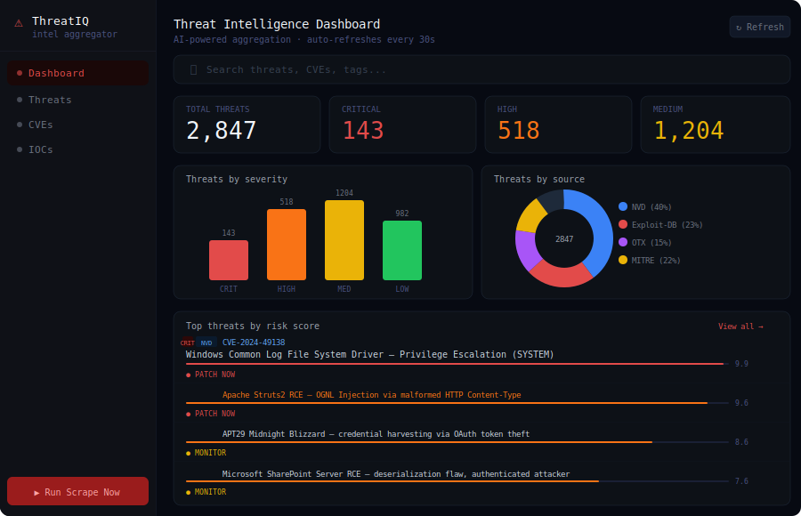

# 🛡️ AI-Powered Threat Intelligence Aggregator

> Automated collection, correlation, and AI-driven analysis of cybersecurity threat intelligence from multiple sources — CVEs, exploit-db, MITRE ATT&CK, and live threat feeds — surfaced in a real-time searchable dashboard.


---

## 📸 Screenshot



---

## ✨ Features

- **Multi-source ingestion** — NVD/CVE, Exploit-DB, MITRE ATT&CK, AlienVault OTX, and AbuseIPDB
- **AI-powered summarization** — Claude API condenses complex advisories into actionable intel
- **Risk scoring engine** — Custom CVSS + exploitability weighting to prioritize threats
- **Real-time dashboard** — Filterable, searchable React frontend with live polling
- **IOC extraction** — Pulls IPs, domains, hashes, and CVE IDs from raw threat data
- **Alerting** — Slack/email webhook notifications for critical-severity findings
- **REST API** — Full API for integration into your own pipelines or SIEM

---

## 🏗️ Architecture

```
┌─────────────────────────────────────────────────────────┐
│                    Threat Sources                        │
│  NVD API │ Exploit-DB │ MITRE ATT&CK │ OTX │ AbuseIPDB  │
└────────────────────────┬────────────────────────────────┘
                         │
                ┌────────▼────────┐
                │  Scraper Engine  │  (scheduled via APScheduler)
                └────────┬────────┘
                         │
                ┌────────▼────────┐
                │  AI Enrichment  │  (Claude API — summarize + tag)
                └────────┬────────┘
                         │
                ┌────────▼────────┐
                │   SQLite / DB   │  (stores enriched intel)
                └────────┬────────┘
                         │
                ┌────────▼────────┐
                │   FastAPI REST  │  (serves frontend + webhooks)
                └────────┬────────┘
                         │
                ┌────────▼────────┐
                │  React Dashboard│  (search, filter, alerts)
                └─────────────────┘
```

---

## 🚀 Quick Start

### Prerequisites
- Python 3.11+
- Node.js 18+
- An [Anthropic API key](https://console.anthropic.com/) (free tier works)
- Optional: AlienVault OTX API key (free)

### 1. Clone & Install

```bash
git clone https://github.com/YOUR_USERNAME/threat-intel-aggregator.git
cd threat-intel-aggregator
```

### 2. Backend Setup

```bash
cd backend
python -m venv venv
source venv/bin/activate        # Windows: venv\Scripts\activate
pip install -r requirements.txt
cp .env.example .env
# Edit .env with your API keys
```

### 3. Frontend Setup

```bash
cd frontend
npm install
cp .env.example .env.local
```

### 4. Run

```bash
# Terminal 1 — Backend
cd backend && uvicorn api.main:app --reload --port 8000

# Terminal 2 — Frontend
cd frontend && npm run dev
```

Open http://localhost:5173

---

## ⚙️ Configuration

Edit `backend/.env`:

```env
ANTHROPIC_API_KEY=sk-ant-...
NVD_API_KEY=                  # Optional, increases rate limits
OTX_API_KEY=                  # Optional
ABUSEIPDB_API_KEY=            # Optional
SLACK_WEBHOOK_URL=            # Optional alerting
SCRAPE_INTERVAL_MINUTES=30    # How often to pull new intel
CRITICAL_SEVERITY_THRESHOLD=9.0
```

---

## 📡 API Endpoints

| Method | Endpoint | Description |
|--------|----------|-------------|
| GET | `/api/threats` | List all threats (paginated) |
| GET | `/api/threats/{id}` | Get single threat detail |
| GET | `/api/threats/search?q=` | Full-text search |
| GET | `/api/threats/stats` | Dashboard statistics |
| GET | `/api/cves/latest` | Latest CVEs from NVD |
| GET | `/api/iocs` | Extracted IOCs |
| POST | `/api/scrape/trigger` | Manually trigger scrape |
| GET | `/api/health` | Health check |

Full API docs available at http://localhost:8000/docs (Swagger UI)

---

## 🗂️ Project Structure

```
threat-intel-aggregator/
├── backend/
│   ├── api/
│   │   ├── main.py          # FastAPI app + router setup
│   │   └── routes/          # Route handlers
│   ├── core/
│   │   ├── ai_enrichment.py # Claude API integration
│   │   ├── risk_scorer.py   # CVSS + exploitability scoring
│   │   └── ioc_extractor.py # IOC parsing from raw text
│   ├── scrapers/
│   │   ├── nvd.py           # NVD/CVE feed scraper
│   │   ├── exploitdb.py     # Exploit-DB scraper
│   │   ├── mitre.py         # MITRE ATT&CK techniques
│   │   └── otx.py           # AlienVault OTX pulses
│   ├── models/
│   │   └── threat.py        # SQLAlchemy models
│   ├── utils/
│   │   ├── scheduler.py     # APScheduler job setup
│   │   └── alerting.py      # Slack/email alerts
│   ├── requirements.txt
│   └── .env.example
├── frontend/
│   ├── src/
│   │   ├── components/      # Reusable UI components
│   │   ├── pages/           # Dashboard, CVE list, IOCs
│   │   ├── hooks/           # useThreats, useSearch
│   │   └── utils/           # API client, formatters
│   ├── package.json
│   └── .env.example
├── docs/
│   └── ARCHITECTURE.md
├── docker-compose.yml
├── .github/
│   └── workflows/
│       └── ci.yml
└── README.md
```

---

## 🧠 How the AI Enrichment Works

Each ingested threat is passed to Claude with a structured prompt:

1. **Summarize** the advisory in 2-3 plain-English sentences
2. **Extract** affected products, CVE IDs, and MITRE ATT&CK technique IDs
3. **Tag** the threat category (RCE, SQLi, Privilege Escalation, etc.)
4. **Recommend** a remediation priority (Patch Now / Monitor / Low Priority)

This turns raw, noisy threat data into analyst-ready intelligence.

---

## 🐳 Docker

```bash
docker-compose up --build
```

Services: `backend` (port 8000), `frontend` (port 5173)

---

## 🗺️ Roadmap

- [ ] Add VirusTotal integration for hash lookups
- [ ] STIX/TAXII export format
- [ ] Email digest (daily/weekly summary)
- [ ] Threat actor tracking/grouping
- [ ] Browser extension for on-demand CVE lookup

---

## 🤝 Contributing

PRs welcome. Please open an issue first to discuss major changes.

---

## 📄 License

MIT — see [LICENSE](LICENSE)
